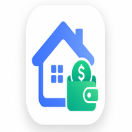

<div align="center">


# 💰 Finanças da Casa

[](https://omartins-zs.github.io/sistema-financas-pessoais)
[](https://php.net)
[](https://laravel.com)
[](https://mysql.com)
[](https://getbootstrap.com)
[](https://firebase.google.com)
[](LICENSE)

<p>Sistema de controle financeiro pessoal e familiar — entradas, despesas, investimentos, cartões, metas e relatórios mês a mês.</p>

<cite>Controle simples, bonito e seguro das finanças do lar, com versão estática para uso diário e versão Laravel completa com banco de dados.</cite>

</div>

---

## 🚦 Status do Projeto

<h4 align="center"> ✅ Finanças da Casa &nbsp;🚀 Em desenvolvimento contínuo ⚙️ </h4>

---

## 📦 Sobre as Versões neste Repositório

Este repositório possui **duas branches principais**, cada uma com um deploy diferente:

| Branch | Tipo | Stack | Uso |
|--------|------|-------|-----|
| [`github-pages`](https://github.com/omartins-zs/sistema-financas-pessoais/tree/github-pages) | 🌐 App Web Estático | HTML + CSS + JavaScript | Uso diário via GitHub Pages |
| [`master`](https://github.com/omartins-zs/sistema-financas-pessoais/tree/master) | 🧱 Monólito | Laravel 13 + Livewire 4 + MySQL | Backend completo com autenticação e banco |

> 🌐 **Demo online (GitHub Pages):** [omartins-zs.github.io/sistema-financas-pessoais](https://omartins-zs.github.io/sistema-financas-pessoais)

---

## 🏗️ Arquitetura do Projeto

**Tipo:** Dual-stack — duas implementações complementares do mesmo produto

| Versão | Classificação | Descrição |
|--------|---------------|-----------|
| **GitHub Pages** | Frontend autônomo | SPA-like em JavaScript vanilla; dados em `localStorage` ou Firebase (opcional). Sem servidor backend próprio. |
| **Laravel (`master`)** | Monólito | Backend + frontend integrados (Blade + Livewire). MySQL, autenticação, Service Layer e Policies. |

Não é API pura nem microserviços — são **dois modos de deploy** do mesmo sistema financeiro familiar.

---

## 🔥 Pré-requisitos

### 🌐 Versão GitHub Pages (estática)

- Navegador moderno (Chrome, Firefox, Edge, Safari)
- **Opcional:** conta Firebase (Auth + Firestore) para sincronização na nuvem — ver [`FIREBASE.md`](FIREBASE.md)

> Não exige Node.js, Composer nem banco de dados para rodar localmente.

### 🧱 Versão Laravel (`master`)

- **PHP 8.3+** (documentação interna: PHP 8.4+)
- **Composer** 2.x
- **MySQL 8.0+** (Laragon: porta **3307**)
- **Node.js 18+** (opcional — build de assets com Vite/Tailwind)
- **Docker Desktop** (opcional — stack Nginx + PHP-FPM + MySQL + Redis)

---

## 🚀 Tecnologias Utilizadas

### 🌐 GitHub Pages — Frontend

| Tecnologia | Versão / Uso |
|------------|----------------|
| HTML5 + CSS3 | Estrutura e layout responsivo |
| JavaScript (ES6+) | Lógica da aplicação (`script.js`, `app-modules.js`) |
| Bootstrap | 5.3.3 (CDN) |
| Bootstrap Icons | 1.11.3 |
| Chart.js | 4.4.7 — gráficos do mês, dashboard e anual |
| Day.js | 1.11.13 — datas e navegação mensal |
| SweetAlert2 | 11.x — modais e confirmações |
| Notyf | 3.x — notificações toast |
| IMask | 7.x — máscara de valores monetários |
| SheetJS (xlsx) | Importação/exportação Excel |
| jsPDF + AutoTable | Exportação PDF |
| Firebase | 10.x — Auth + Firestore (opcional) |

### 🧱 Laravel — Backend + Frontend

| Tecnologia | Versão |
|------------|--------|
| PHP | ^8.3 |
| Laravel Framework | ^13.8 |
| Livewire | ^4.3 |
| MySQL | 8.0+ |
| PhpSpreadsheet | ^5.8 — importação/exportação |
| Tailwind CSS | ^4.0 (Vite) |
| Docker | Nginx + PHP-FPM + MySQL + Redis |

### 📐 Padrões e organização

- **GitHub Pages:** módulos separados (`app-modules.js`), camada de storage (`cloud-sync.js`), normalização de dados
- **Laravel:** MVC, Service Layer (`FinancialEntryService`), Form Requests, Policies, PHP Enums (`EntryType`, `EntryStatus`, `EntryPerson`)

---

## 🔨 Funcionalidades

### 🌐 Versão GitHub Pages (uso diário)

- 📅 **Controle mensal** — navegação por mês/ano, copiar mês anterior e limpar mês
- 💵 **Entradas, despesas e investimentos** — tipos separados com cálculo de **Sobra** (Entradas − Despesas − Investimentos)
- 🏷️ **Tags** — Gabriel, Barbara, Casa, Família
- ✅ **Status** — Pago, Reservado, Não pago (seletor segmentado responsivo)
- 💳 **Cartões Gabriel e Babi** — itens colapsáveis na fatura, recorrentes, copiar/colar/editar, Enter para adicionar, arrastar para reordenar
- 📋 **Contas fixas** — serviços recorrentes + sugestões automáticas dos últimos 3 meses
- 📊 **Módulos** — Dashboard, Anual, Metas, Reservas, Cartões, Investimentos, Patrimônio, Relatórios
- 🔎 **Relatórios** — busca por texto, filtros que aplicam na hora, colunas ordenáveis, gráfico de despesas por categoria e exportação (CSV/Excel/PDF) com totais
- 🔔 **Alertas inteligentes** — vencimentos, metas, faturas e contas fixas
- 📥 **Importação** — CSV, Excel e backup JSON
- 🏦 **Extrato bancário** — importa OFX, CSV e QIF exportados do banco (Nubank: extrato e fatura). Cada lançamento vai para o mês da própria data, duplicados são pulados (Identificador/FITID), nomes limpos (Shopee, Mercado Livre, Mercado Pago com vendedor, Pix com nome) e categoria sugerida pela descrição
- 📤 **Exportação** — CSV, Excel, PDF e JSON
- 📱 **PWA instalável** — instala como app no celular/tablet, funciona offline e atualiza sozinho no refresh (service worker *network-first*); versão visível no cabeçalho
- 🌙 **Tema claro/escuro**
- 📱 **Responsivo** — mobile, tablet e desktop
- ☁️ **Firebase opcional** — login e sync multi-dispositivo ([`FIREBASE.md`](FIREBASE.md))

### 🧱 Versão Laravel (`master`)

- 🔐 **Autenticação** — login/logout, dados isolados por usuário
- 📅 **Dashboard financeiro** — Livewire com resumo mensal
- ➕ **CRUD de lançamentos** — entradas, despesas e investimentos
- 🏷️ **Tags e categorias** configuráveis
- 📥📤 **Importação/exportação** — CSV e Excel (PhpSpreadsheet)
- 🐳 **Docker** — stack completa documentada em `docs/`
- 🧪 **Seeders** — usuário demo e lançamentos de exemplo

---

## 🎯 Sobre o Projeto

Sistema desenvolvido demonstrando boas práticas de desenvolvimento, arquitetura limpa e organização de código, com foco em escalabilidade e manutenção.

Projeto pensado para **controle financeiro familiar real** — Gabriel e Barbara compartilham lançamentos via mesma conta Firebase ou backup JSON, com visão clara de cartões, contas fixas, metas e sobra do mês.

---

## 📸 Preview do Projeto

<div align="center">



🚧 Preview animado (GIF) não disponível no repositório.

</div>

---

## 📊 Estrutura de banco de dados (Google Firebase)

> **Documentação gerada** com base no schema da branch `github-pages` (`cloud-sync.js`).  
> Esta versão **não usa MySQL** — os dados ficam em um documento JSON por usuário no **Firebase Firestore** (Google) ou, sem login, no `localStorage`.

### Armazenamento

| Modo | Onde | Caminho |
|------|------|---------|
| **Nuvem (Google)** | Firebase **Firestore** | `financas` → `{uid}` |
| **Local** | `localStorage` | chave `financas_casa_dados` |

```
Firestore
└── financas                    ← coleção
    └── {uid}                   ← 1 documento por usuário (Firebase Auth)
        ├── data      (string)  ← JSON completo do app
        └── updatedAt (timestamp)
```

**Fluxo:** login com Firebase Authentication → carrega `financas/{uid}.data` → `JSON.parse` → ao salvar, serializa de volta (debounce ~600 ms).

---

### JSON raiz (`allData`)

```json
{
  "2026-06": [ "lançamentos do mês" ],
  "2026-07": [ "..." ],
  "__app": {
    "metas": [],
    "reservas": [],
    "cartoes": [],
    "comprasCartao": [],
    "investimentos": [],
    "patrimonio": [],
    "assinaturas": []
  }
}
```

| Chave | Tipo | Descrição |
|-------|------|-----------|
| `"YYYY-MM"` | array | Lançamentos daquele mês |
| `"__app"` | object | Metas, cartões, contas fixas, etc. (não entra no cálculo mensal) |

---

### Lançamento (`"YYYY-MM"[]`)

| Campo | Tipo | Valores |
|-------|------|---------|
| `id` | string | ID único |
| `description` | string | Nome |
| `category` | string | Ex.: Mercado, Cartão de crédito Gabriel |
| `type` | string | `entrada` · `despesa` · `investimento` |
| `person` | string | `gabriel` · `barbara` · `casa` · `familia` |
| `value` | number | Valor (R$) |
| `status` | string | `pago` · `reservado` · `nao_pago` |
| `due_day` | number \| null | Dia de vencimento |
| `observation` | string | Observação |
| `card_items` | array | Itens da fatura (cartões) |

**Item de cartão (`card_items[]`):** `id`, `description`, `value`, `recurring` (boolean), `isDefault` (opcional)

---

### Módulos em `__app`

| Chave | Conteúdo principal |
|-------|-------------------|
| `metas[]` | `nome`, `valorObjetivo`, `dataAlvo`, `prioridade`, `status`, `aportes[]` |
| `reservas[]` | `nome`, `objetivo`, `movimentacoes[]` (`deposito` / `saque`) |
| `cartoes[]` | `nome`, `bandeira`, `limite`, `fechamento`, `vencimento` |
| `comprasCartao[]` | `cartaoId`, `descricao`, `valor`, `parcelas`, `data`, `categoria` |
| `investimentos[]` | `tipo`, `instituicao`, `valorAplicado`, `valorAtual`, `data` |
| `patrimonio[]` | `nome`, `tipo`, `valorCompra`, `valorAtual`, `dataAquisicao` |
| `assinaturas[]` | Contas fixas: `nome`, `valor`, `vencimentoDia`, `forma`, `status` |

Configuração Firebase: [`FIREBASE.md`](FIREBASE.md) · Versão detalhada: [`docs/ESTRUTURA-BANCO-DADOS.md`](docs/ESTRUTURA-BANCO-DADOS.md)

---

## 📁 Outros guias

| Arquivo | Conteúdo |
|---------|----------|
| [`FIREBASE.md`](FIREBASE.md) | Configurar Auth + Firestore |
| [`dados/README.md`](dados/README.md) | Importação CSV/Excel |

> Branch `master` (Laravel + MySQL): guias em `docs/COMO_EXECUTAR*.md` após `git checkout master`.

---

## 💻 Comandos

### 🌐 GitHub Pages — uso local

```bash
# Clone e acesse a branch estática
git clone https://github.com/omartins-zs/sistema-financas-pessoais.git
cd sistema-financas-pessoais
git checkout github-pages

# Opção 1: abrir direto no navegador
# Abra index.html (recursos via CDN)

# Opção 2: servidor local simples
npx serve .
# ou: php -S localhost:5500
```

Acesse: **http://localhost:5500** (ou a porta do seu servidor)

**Firebase (opcional):** edite [`firebase-config.js`](firebase-config.js) conforme [`FIREBASE.md`](FIREBASE.md).

---

### 🚀 Publicar no GitHub Pages

O Pages serve a própria branch `github-pages` na raiz: **basta o push** que o build roda sozinho.

Antes do push, **troque a versão no [`index.html`](index.html)** — ela aparece no
`<meta name="app-version">` e no `?v=` de cada arquivo, sempre com o mesmo valor:

```bash
# no Git Bash / Linux / macOS — troque o valor antigo pelo novo
sed -i 's/20260815-1/20260815-2/g' index.html
```

Esse único valor comanda tudo: o selo de versão no cabeçalho, a URL do service
worker (`sw.js?v=…`), o nome do cache e o `?v=` de CSS/JS.

**Por que isso importa:** o GitHub Pages manda `Cache-Control: max-age=600` em tudo.
Sem versão na URL, um refresh no celular reaproveita o CSS/JS antigo e o aparelho
fica preso numa versão velha. Com o `?v=` novo, a URL é outra e todo dispositivo
baixa a versão nova. O service worker fecha o cerco: ele busca o HTML sempre na
rede (`cache: 'no-store'`), então o próprio refresh já traz a versão mais recente.

---

### 🧱 Laravel — instalação local

```bash
git checkout master
composer install
cp .env.example .env
php artisan key:generate
php artisan migrate --seed
php artisan serve
```

Acesse: **http://127.0.0.1:8000**

```bash
# Assets frontend (opcional)
npm install
npm run dev
```

---

### 🐳 Laravel — Docker

```bash
git checkout master
cp .env.docker.example .env
docker compose up -d --build
docker compose exec app composer install
docker compose exec app php artisan key:generate
docker compose exec app php artisan migrate --seed
```

Acesse: **http://localhost:8080**

> ⚠️ Estes são comandos básicos. Verifique no projeto arquivos como:
> `README.md`, `docs/COMO_EXECUTAR.md` ou `docs/COMO_EXECUTAR_DOCKER.md` para instruções completas.

---

## 🔑 Usuário de demonstração

| Versão | E-mail | Senha |
|--------|--------|-------|
| Laravel (`master`) | `casa@financas.com` | `password` |
| GitHub Pages + Firebase | Crie conta no primeiro acesso | — |

---

## 🧱 Estrutura do Projeto

### Branch `github-pages`

```
├── index.html              # Página principal (e a versão do app, no <meta app-version>)
├── script.js               # Core: CRUD, cartões, import/export
├── app-modules.js          # Módulos: Dashboard, Metas, Cartões…
├── cloud-sync.js           # LocalStorage + Firebase
├── firebase-config.js      # Config Firebase (opcional)
├── style.css / modules.css # Estilos
├── sw.js                   # Service worker (PWA, network-first)
├── manifest.webmanifest    # Manifesto do PWA
├── icon-*.png              # Ícones do PWA (192/512, normal e maskable)
├── template-importacao.*   # Templates CSV/Excel
├── FIREBASE.md             # Guia sync na nuvem
└── dados/README.md         # Guia de importação
```

### Branch `master` (Laravel)

```
├── app/
│   ├── Enums/              # EntryType, EntryStatus, EntryPerson
│   ├── Http/Controllers/   # Dashboard, entries, import/export
│   ├── Models/             # FinancialEntry, User
│   ├── Policies/           # Autorização por user_id
│   └── Services/           # FinancialEntryService, FinancialSheetService
├── database/migrations/    # Schema MySQL
├── resources/views/        # Blade + Livewire
├── docs/                   # Guias de execução
├── docker/                 # Config Nginx, PHP, OPcache
├── Dockerfile
└── docker-compose.yml
```

---

## 📝 Melhorias Futuras

- [ ] PWA com instalação offline na versão GitHub Pages
- [ ] Sincronização bidirecional Laravel ↔ GitHub Pages
- [ ] Relatórios avançados com filtros salvos
- [ ] Notificações push de vencimentos
- [ ] App mobile nativo ou Capacitor
- [ ] Multi-família com convites por e-mail

---

## 🖋️ Dicas

- **Backup:** exporte JSON mensalmente (`Exportar → JSON — backup completo`)
- **Compartilhar com cônjuge:** use a mesma conta Firebase ([`FIREBASE.md`](FIREBASE.md))
- **Importar planilha:** use `template-importacao.csv` como base
- **Laragon:** branch `master` aponta `public/` como document root

---

<div align="center">

Feito com ❤️ por Gabriel Martins 🚀

</div>
